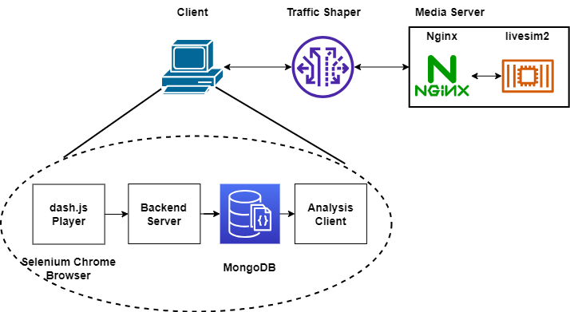
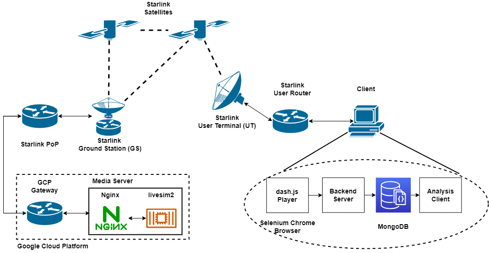

# MMSys'24 Artifact "Low-Latency Live Video Streaming over a Low-Earth-Orbit Satellite Network with DASH"

 [](https://dl.acm.org/doi/10.1145/3625468.3647616)

This repository contains the implementation and artifacts for the paper ***[Low-Latency Live Video Streaming over a Low-Earth-Orbit Satellite Network with DASH](https://dl.acm.org/doi/10.1145/3625468.3647616)*** published in ACM MMSys'24.

**We received the [DASH-IF Excellence in DASH Award Third Place](https://dashif.org/news/mmsys2024/) at MMSys'24**

Table of Contents
=================

  * [Repository structure](#repository-structure)
  * [Prerequisites](#prerequisites)
  * [Re-generate paper results](#re-generate-paper-results)
  * [Emulation](#emulation)
  * [Real world experiments](#real-world-experiments)
  * [Extensions](#extensions)
  * [License](#license)

## Repository structure

```
├── assets                          # figures for README.md
├── dash.js                         # git submodule for the modified dash.js player
├── docker-compose-emulation.yaml   # docker compose file for network emulation
├── docker-compose-server.yaml      # docker compose file for the media server in real world experiments
├── docker-compose.yaml             # docker compose file for the streaming client in real world experiments
├── Dockerfile-dashjs               # Dockerfile to build custom dash.js
├── Dockerfile-livesim2             # Dockerfile to build livesim2
├── Dockerfile-nginx                # Dockerfile to build nginx
├── Dockerfile-nginx-emulation      # Dockerfile to build nginx with traffic shaper in network emulation
├── Dockerfile-runner               # Dockerfile to build experiment runner
├── etc                             # nginx config files
├── experiments                     # experiment config files
├── livesim2                        # git submodule for livesim2
├── paper-data                      # git submodule for the data used to generate figures in the paper
├── poetry.lock
├── pyproject.toml
├── README.md
├── runner                          # experiment scheduler and runner
├── shaper                          # config files for the traffic shaper in network emulation
├── stats-server                    # backend server to store playback metrics
├── terraform                       # Terraform template to provision VM on GCP
└── webassembly                     # Dockerfile to build custom pyodide WebAssembly Python runtime
```

---

## Prerequisites

Any system capable of running recent versions of [Docker](https://docs.docker.com/engine/install/) and [Docker Compose](https://docs.docker.com/compose/) should suffice. The results of this paper were produced on Debian 12.5 x86-64 with Docker version 25.0.3 and the [Compose plugin](https://docs.docker.com/compose/install/linux/) version 2.24.5. However, the [Compose standalone](https://docs.docker.com/compose/install/standalone/) should also work.

To install Docker and Docker compose plugin on a recent Linux distribution, you can use the following automated installation script.

```bash
curl -fsSL https://get.docker.com | sh
```

---

This repository features three distinct levels of reproducibilities.

[Re-generate paper results](#re-generate-paper-results)

[Emulation](#emulation)

[Real world experiments](#real-world-experiments)

## Re-generate paper results

To re-generate the figures in the paper, you can either follow the following steps or directly use the code capsule on [Code Ocean](https://codeocean.com/) at [DOI: 10.24433/CO.7355266.v1](https://doi.org/10.24433/CO.7355266.v1).

Clone this repository.

```bash
git clone https://github.com/clarkzjw/mmsys24-starlink-livestreaming.git
git submodule update --init --recursive
```

In the root directory of this repository, run

```bash
sudo docker run --rm -v ${PWD}/paper-data/data:/data -v ${PWD}/paper-figures:/app/src/figures -it clarkzjw/mmsys24-reproducibility
```

After the command finishes, the figures in the paper will be generated in the `paper-figures` folder.

## Emulation

The topology for our network emulator is shown as follows.



To conduct video streaming using our purpose-built network emulator, please follow the following steps.

0. Apply file watch limit adjustment on the Linux machine used to run emulations

```bash
echo fs.inotify.max_user_watches= 131070 | sudo tee -a /etc/sysctl.conf && sudo sysctl -p
```

1. Pull Docker images used in emulation.

```bash
sudo docker compose -f docker-compose-emulation.yaml pull
```

2. The default [experiments/batch-emulation.json](./experiments/batch-emulation.json) file used for our emulation needs 13.3 hours to complete (`300` seconds in each round x `10` rounds per setting x `4` latency targets x `4` algorithms). You can update the experiment parameters in the [experiments/batch-emulation.json](./experiments/batch-emulation.json) file accordingly by changing the values of `ROUND_DURATION` and `TOTAL_ROUNDS`.

3. Start video streaming emulation with Docker Compose.

```bash
sudo docker compose -f docker-compose-emulation.yaml up -d
```

4. A convenience container is available to display the video streaming browser output using noVNC. This can be accessed by navigating to `http://<host-ip>:7900/?autoconnect=1&resize=scale&password=secret` in a web browser, where `<host-ip>` represents the IP address of the Linux machine on which the emulation takes place. The video streaming browser output is recorded for visual inspection. 

You can disable the creation of this convenience container by setting the `VIDEO` environment variable to `0` in [`docker-compose-emulation.yaml`](https://github.com/clarkzjw/mmsys24-starlink-livestreaming/blob/master/docker-compose-emulation.yaml#L39).

5. You can check the experiment running process and logs by

```bash
sudo docker logs -f dashjs-runner
```

where the expected execuation time for the entire experiment set will be printed.

```bash
[...]
2024-03-06 09:18:46.937 INFO batch_runner - <module>: Total experiment count: 160, duration: 48000 seconds (13.333333333333334 hours)
[...]
```

6. When video streaming emulation finishes, `dashjs-runner` container will output the following log and exit.

```bash
[...]
2024-03-06 08:54:46.489 INFO batch_runner - <module>: Video Streaming completed.
```

The raw data will be available in the `figures-emulation` folder. 

7. Then, you can use the similar command as in [Re-generate paper results](#re-generate-paper-results) to generate the figures.

***Note***: The figure generation scripts in the `clarkzjw/mmsys24-reproducibility` Docker image only support three different experiment scenario names within the `${PWD}/figures` directory, i.e., `emulation`, `starlink` and `terrestrial`. You can copy our results for `starlink` and `terrestrial` from [`paper-data/data`](./paper-data/data) to your `figures` directory and generate figures for evaluation and comparison.

```bash
sudo docker run --rm -v ${PWD}/figures-emulation:/data -v ${PWD}/paper-figures:/app/src/figures -it clarkzjw/mmsys24-reproducibility
```

8. After finishing the emulation, you can cleanup the resources by

```bash
sudo docker compose -f docker-compose-emulation.yaml down
```

## Real world experiments

The topology for our real world experiment is shown as follows.



To conduct video streaming over real networks, please follow the following steps.

***Note***

The results for the "Starlink" and "Terrestrial" scenarios in the paper are generated with a media server VM provisioned at the Google Cloud Platform (GCP). A Terraform template is provided to provision VM on GCP. However, if you are using other cloud providers to provision VM as a media server or you are using local servers, you can manually install the required softwares by running the commands in [`cloud-config.yaml`](./terraform/cloud-config.yaml) and jump to [Media VM Setup](#media-vm-setup).

### Install Terraform

https://developer.hashicorp.com/terraform/install

### Install gcloud CLI

https://cloud.google.com/sdk/docs/install

Run `gcloud init` to authenticate.

### Provision VM on GCP with Terraform

1. Edit `terraform.tfvars`, update `gcp_project_id` and `ssh_public_key`.

2. Run `terraform init` to initialize Terraform, installing Terraform providers.

3. Run `gcloud auth application-default login` to obtain the GCP credentials for Terraform.

4. Finally, run `terraform plan` and `terraform apply` to provision VM on GCP, the public IP address for the VM will be printed on the terminal.

5. SSH login to the new VM, wait until `/var/log/cloud-init-output.log` is finished.

```bash
[...]

Cloud-init v. 23.1.2-0ubuntu0~23.04.1 finished at Fri, 08 Dec 2023 23:20:04 +0000. Datasource DataSourceGCELocal.  Up 1117.00 seconds
```

### Media VM Setup

1. Apply File Watch Limit adjustment

```bash
echo fs.inotify.max_user_watches= 131070 | sudo tee -a /etc/sysctl.conf && sudo sysctl -p
```

2. Apply UDP buffer size adjustments

https://github.com/quic-go/quic-go/wiki/UDP-Buffer-Sizes

```bash
sudo sysctl -w net.core.rmem_max=2500000
sudo sysctl -w net.core.wmem_max=2500000
```

For real world experiments, deploy live video streaming media server on the VM by

```bash
sudo docker compose -f docker-compose-server.yaml pull
sudo docker compose -f docker-compose-server.yaml up -d
```

3. The MPD file will be retrieved at

`https://<ip-or-domain-of-the-media-server>/livesim2/vectors/switching_sets/12.5_25_50/ss1/2023-04-28/stream.mpd`

4. **[Optional]** If you want to check the MPD locally in your browser with [dash.js example player](https://reference.dashif.org/dash.js/latest/samples/low-latency/testplayer/testplayer.html), you might want to visit the URL once to acknowledge the insecure HTTPS warning, before putting the MPD URL in the `Manifest URL`.

5. Update [`experiments/batch-experiment.json`](./experiments/batch-experiment.json) with the new MPD_URL by replacing `<ip-or-domain-of-the-media-server>`.

6. The following steps are similar to [network emulation](#emulation), but you need to replace `docker-compose-emulation.yaml` with `docker-compose.yaml` in the command.

## Extensions

### Custom video dataset

To replace the default bitrate ladder and use custom video datasets, replace and update the following lines in [Dockerfile-livesim2](./Dockerfile-livesim2) accordingly,

```Dockerfile
# RUN ./dashfetcher -a https://dash.akamaized.net/WAVE/vectors/switching_sets/12.5_25_50/ss1/2023-04-28/stream.mpd
# COPY stream.mpd /livesim2/WAVE/vectors/switching_sets/12.5_25_50/ss1/2023-04-28/
# RUN cd /livesim2/WAVE/vectors && mv cfhd_sets chdf_sets switching_sets/12.5_25_50/ss1/2023-04-28/

RUN wget https://starlink-dash-live.jinwei.me/WAVE.zip && unzip WAVE.zip && rm WAVE.zip
```

and rebuild the `livesim2` Docker image and replace the image used by the `livesim2` service in the corresponding `docker-compose.yaml` file.

## License

The code in this repository is licensed under [GPL-3.0](./LICENSE).
